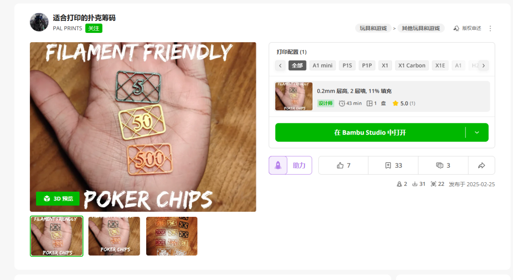
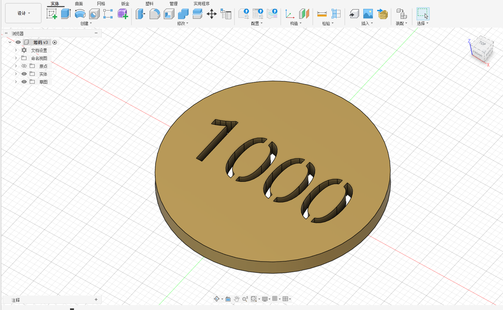
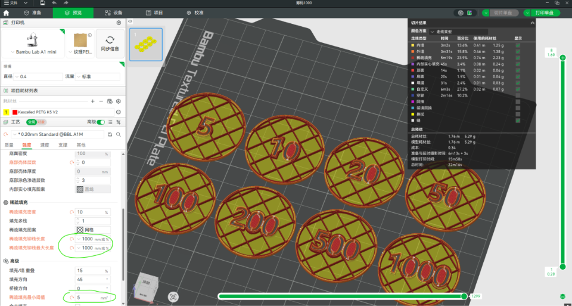
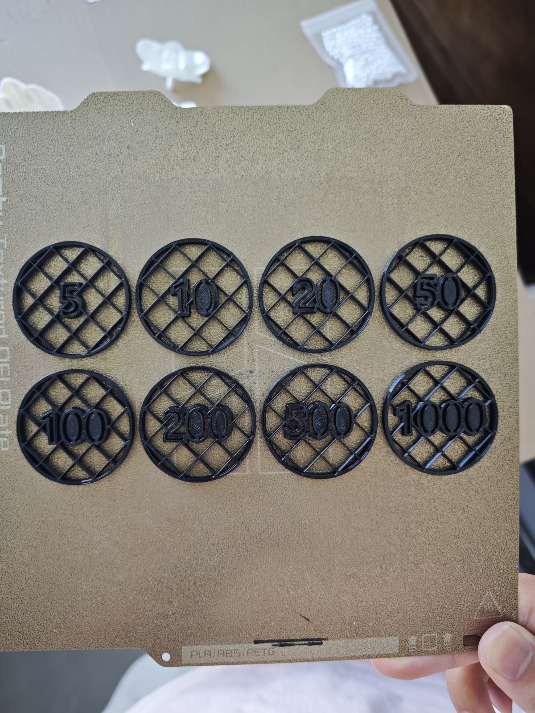

##### 引子：

> 之前过年时，亲戚来家里玩要打扑克，没有筹码计数，于是想打印了一些筹码
>
> 在MakeWorld里面找模型，主要有两个比较方向：1、必须打印的快，因为赶着要出一大批，2、要省料，因为筹码买一整盒也没多少钱，如果太厚重，时间和别的成本也上去了，不划算。

最后选了这款：

##### 网上模型实际用下来发现的问题：

<u>方的造型</u>拿取、收纳都不方便；仔细看中间有些填充有问题，不够优雅

##### 我重新设计：

于是找了一个晚上设计了这款，刚开始采用国际筹码标准39mm-3.5mm，感觉太大没必要，缩放为1.5mm：

打印时的设置如图，打印8个仅需要5.3g，22分钟：

其中两个绿色圈：
稀疏填充长度，设置成无限长可以让整体的填充方形更完整；
稀疏最小填充：改小一点可以防止小的填充，如**5-0**之间的小缝隙没有填充。 

##### 打印效果：

最终打印出来效果还可以：

