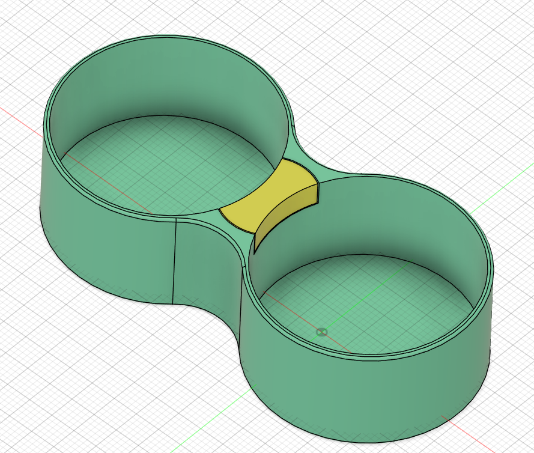
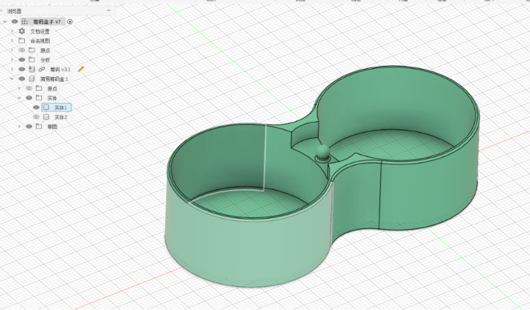
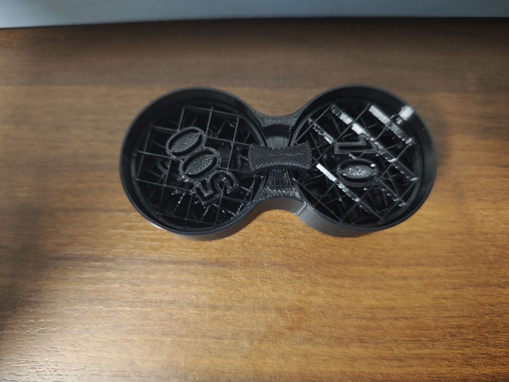
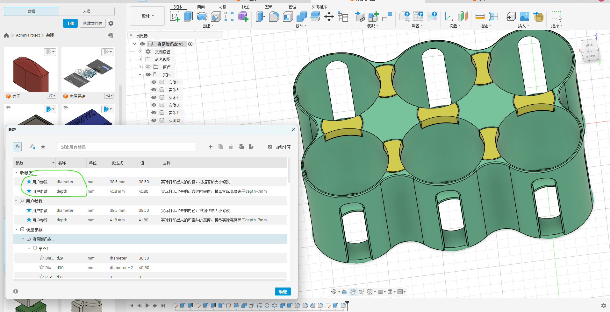
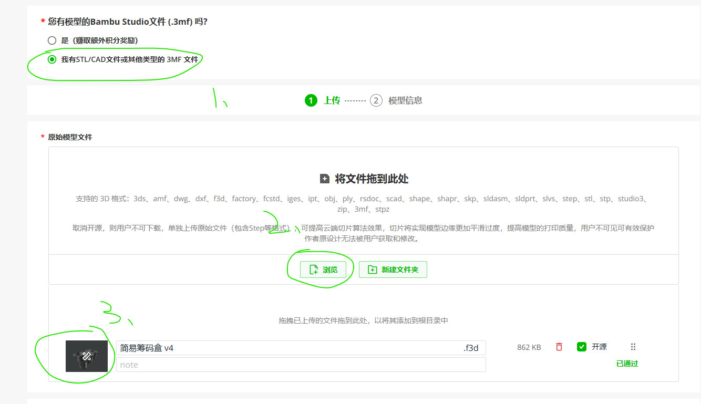
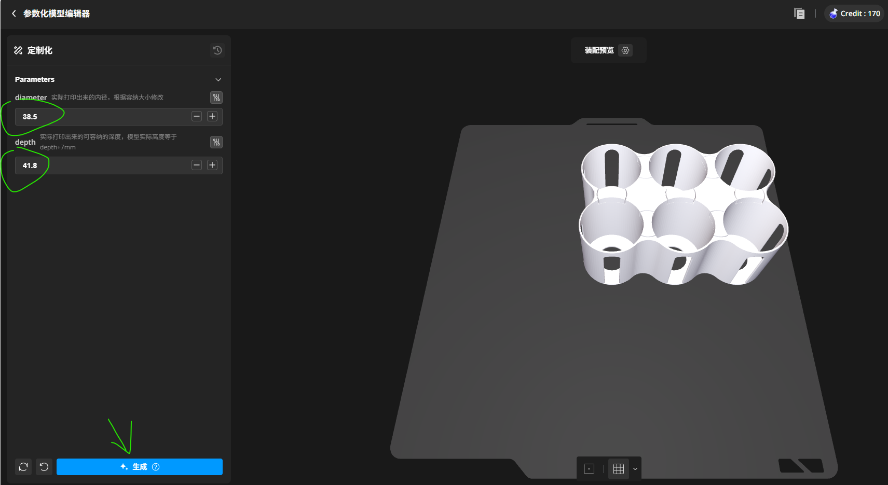
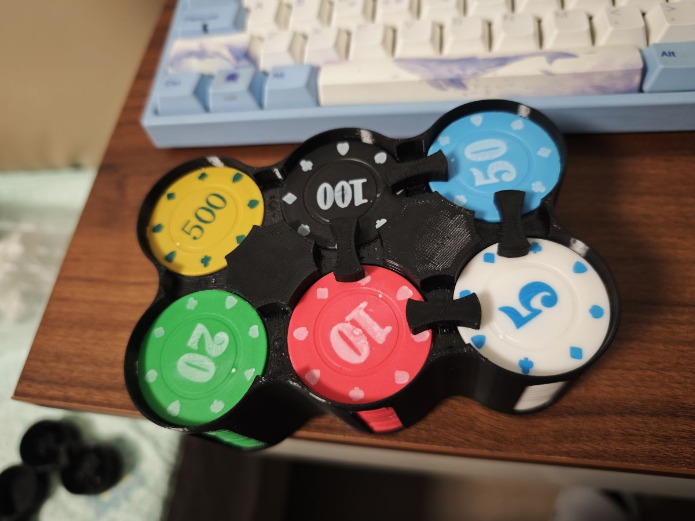

筹码打印完后，寻思应该制作一个收纳盒

##### 初代版本：

在网上找一圈没有完全符合尺寸的收纳盒，于是我准备自己设计一款，为我的筹码量身打造，初代版本如下：

##### 设计技巧：

整体包括中间的横块采用一体打印，受这个视频启发[3D打印切片：熨烫堆叠打印](https://www.bilibili.com/video/BV1ijbLzZEgt)，在接触面之间熨烫，然后在上移0.2mm，可以很方便让两层之间不粘那么紧，一下就掰开了；

凸起的圆柱与活动件，中间间隙保留为0.2，这样打印出来的件可以旋转，用来压住筹码，这样外出携带以及存放都非常方便。

##### 衍生设计：

但考虑到我有很多买的筹码（过年后补的，一直在找机会打德州），而且想做一个可定制尺寸的通用型筹码盒，于是一咬牙，就干：

1. 先设计好要能容纳的深度和直径，然后建模时都使用这个相对值，最后保存成.f3d文件：

   

2. 上传到mw官网时，选择有源文件，再上传f3d文件，等通过后，点击定制的图标按钮：

   

3. 可以在这里设置初始参数，以及切片参数等，点击生成等一会就可以成功生成了：

   

4. 最后打印出来，看起来还可以，但有一些问题，这个在后续文章中介绍和解决：

   