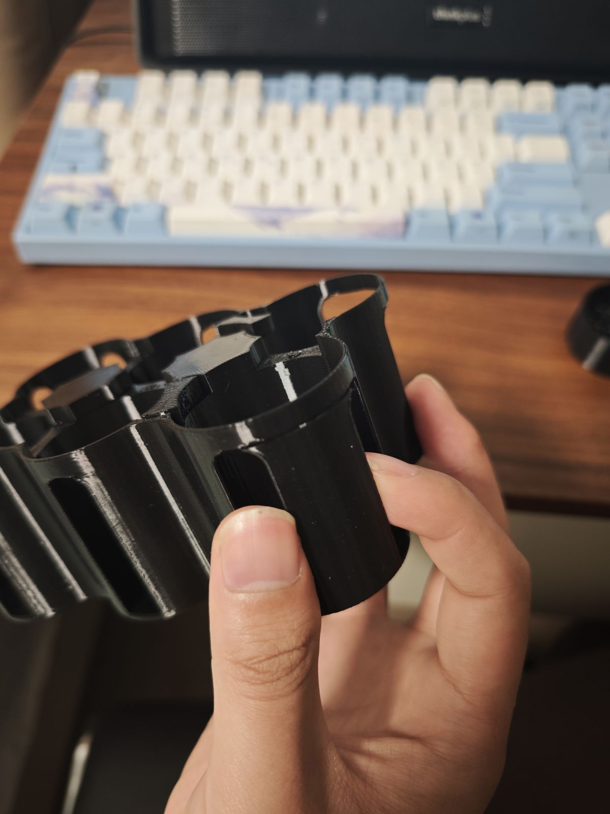
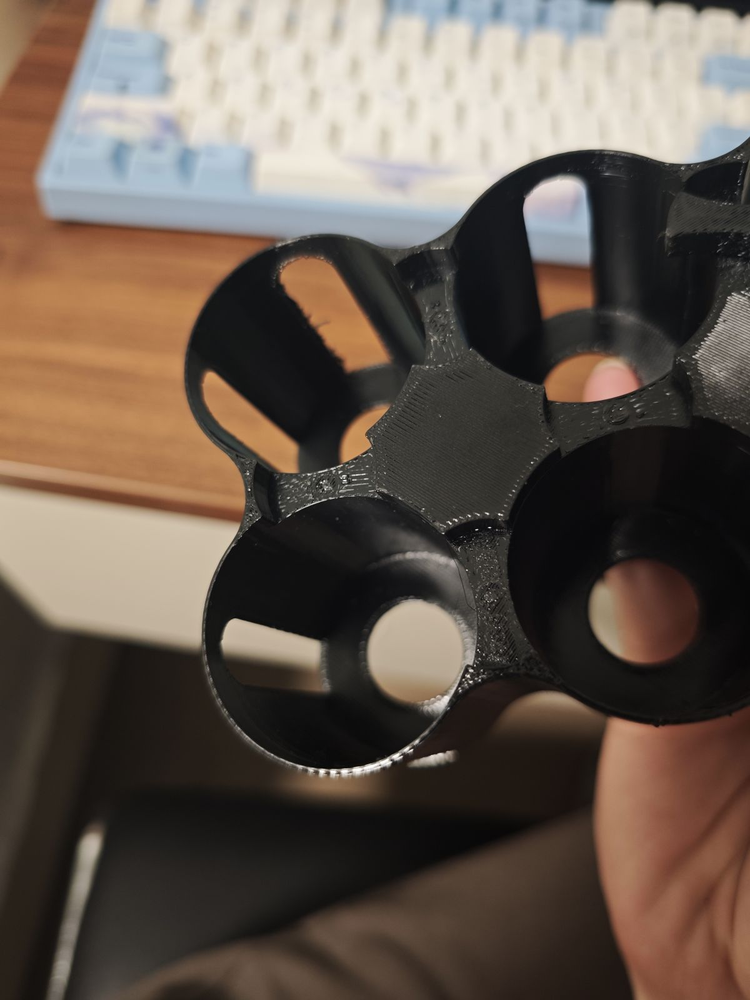
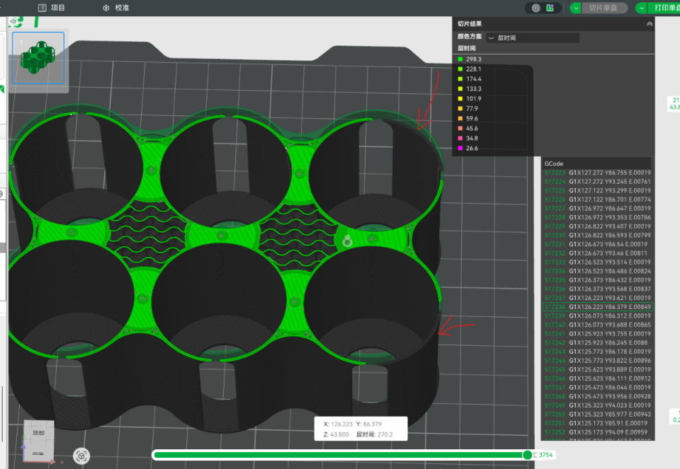
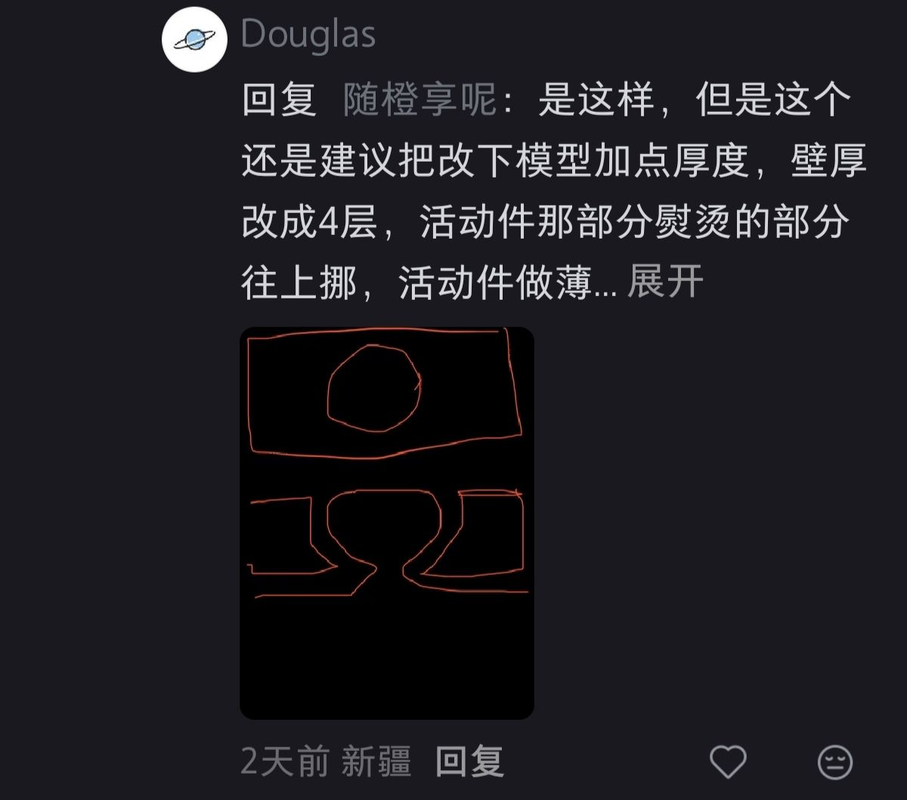
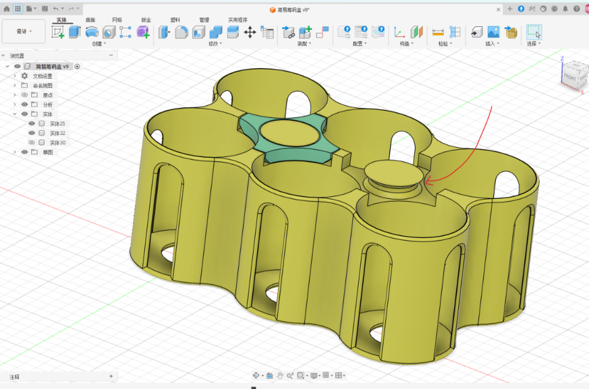
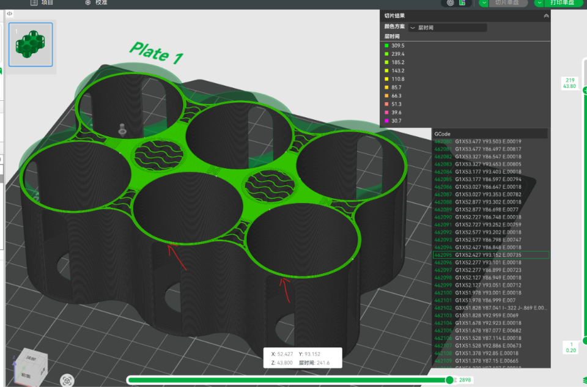
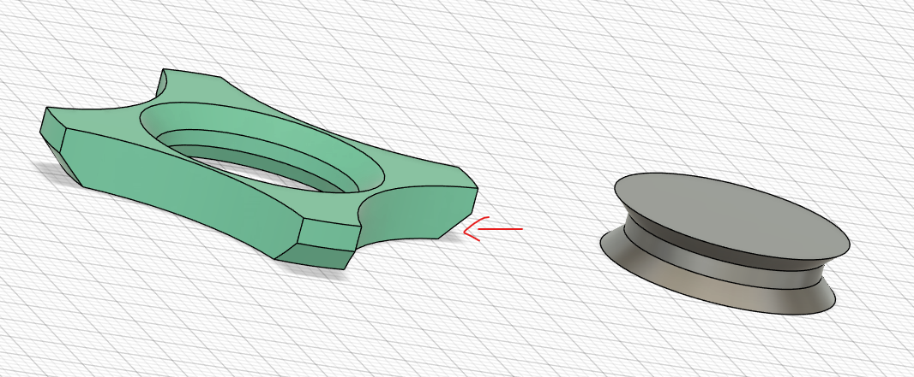
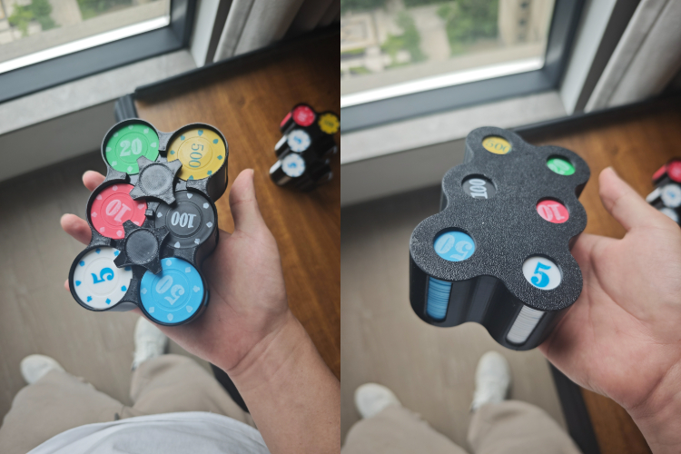

书接上回，这个筹码盒打印了两版，发现如下两个比较严重的问题：

### 发现的问题问题：

#### 侧面存在断裂

   	

#### 顶部有些地方掰开时会直接掉下来

   

### 排查：

针对第一个**侧面存在断裂**问题，肯定先是排查层时间问题，观察打印到这层的顺序，因为这里有特殊工艺，需要在这层熨烫。当需要熨烫的面打印完成后，立马开始熨烫，一直到熨烫完才继续打印，这两块的打印时间被留到最最后，导致层时间差距太大，也可能是熨烫使喷嘴稍微变歪。（如下图红色）

针对第二个**圆柱容易掰断**的问题，本身受限于FDM打印，在Z轴上的层间粘合力不足，在小红书上和大佬讨论，受到一些启发，应该把柱子上面留出来，免得像现在这样，可能会悬垂让活动的地方粘连。

### 解决：

结合自己的设计经验，重新设计为如下样式：

1. 第一个问题的解决方式是，将圆角的距离下调1mm，让其熨烫这层和带挖洞的层无交叠

   

2. 第二个问题的解决方式是，将圆柱放置在中间区域，同时下面和上面都加上倒角，下倒角的目的是减小接触面，上倒角可以防止转动的固定性。周边四个增加了1/2的倒角，减小接触面的同时，也能方便翘起

### 成品展示：

