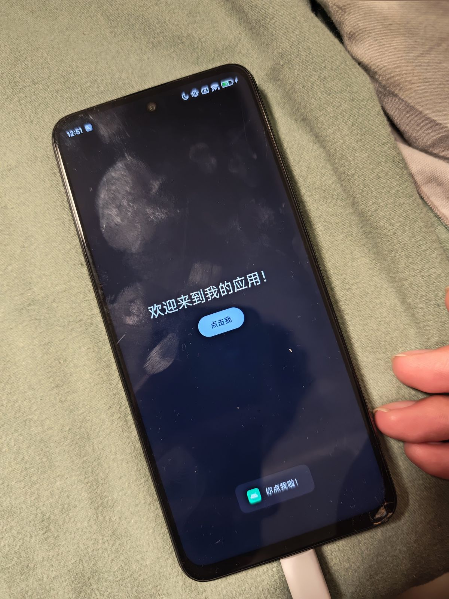

##### 1、安装Android Studio

​	这个简单找官网一下就安装好了

##### 2、启动后配置中文

​	这个有点麻烦，到github上下载最新的idea中文插件[AndroidStudioChineseLanguagePack](https://github.com/sollyu/AndroidStudioChineseLanguagePack/releases)，然后到插件地方选择手动安装，打开这个jar，到设置的语言地方切换到中文，然后重启就可以了

##### 3、编译第一个项目

​	这个也有点麻烦，主要是国外的gradle源下载不动啊！

​	这里新建先选择Empty Activity工程，千问说更适合新手，修改`gradle-wrapper.properties`文件，把类似于

```properties
#distributionSha256Sum=b266d5ff6b90eada6dc3b20cb090e3731302e553a27c5d3e4df1f0d76beaff06
#distributionUrl=https\://services.gradle.org/distributions/gradle-9.3.1-bin.zip
distributionUrl=https\://mirrors.cloud.tencent.com/gradle/gradle-9.3.1-all.zip
```

​	注意，不要换成**`gradle-9.3.1-all.zip`**，不然下载完bin，还要从源地址下载源码用于调试，还是很慢！如果还不行自己到[tencent gradle](https://mirrors.cloud.tencent.com/gradle/)下载好放到那个目录里

​	等gradle完成后，就可以烧录到手机，或者这里启动仿真试一下了，我建议烧录到手机玩，因为仿真还得下2G的仿真器哈哈哈

##### 4、今天完成安卓app创建、传到手机测试，按钮点击等初步学习

​	这个是部署效果：

