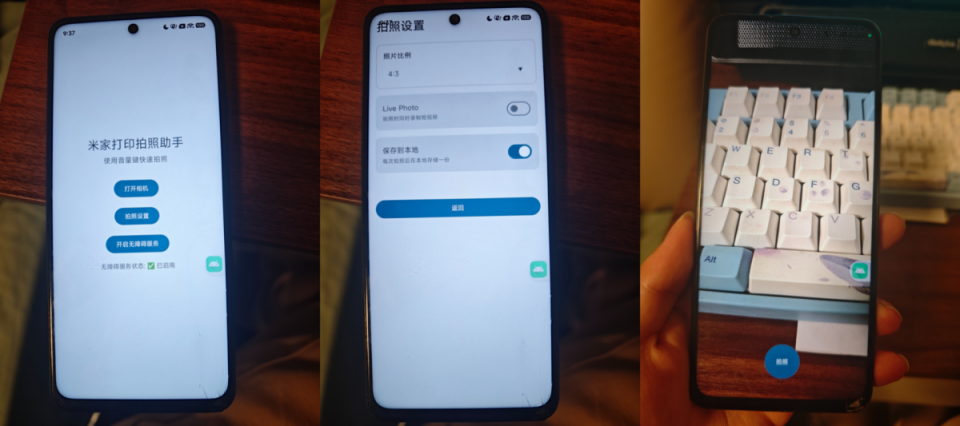

##### 1、今天上来千问先让我用adb查米家打印的接口

刚开始用as命令行输入adb报错，查了一下，要把adb路径加入到环境变量，重启确实可以了

输入`adb shell uiautomator dump`获取当前界面的布局，结果失败了。。。

最后按照

```shell
# 1. 清除旧文件（避免干扰）
& "C:\Users\xiong\AppData\Local\Android\Sdk\platform-tools\adb.exe" shell rm /sdcard/window_dump.xml

# 2. 等待 2 秒 + 执行 dump（用 shell 命令组合）
& "C:\Users\xiong\AppData\Local\Android\Sdk\platform-tools\adb.exe" shell "sleep 2 && uiautomator dump --compressed"

# 3. 检查是否生成文件
& "C:\Users\xiong\AppData\Local\Android\Sdk\platform-tools\adb.exe" shell ls /sdcard/window_dump.xml
```

获取了`window_dump.xml`文件

把这个xml发给ai，表示没有读取到打印字样接口

##### 2、换一种办法，直接模拟点击右上角的打印图标，让ai帮我写安卓程序

方法流程：1）下载安装了Trae CN，这个据说还可以

2）让他给我编写拍照、调用分享接口、跳转到米家app后，稍微等几秒钟模拟点击右上角打印按钮

3）编译报错，把错误发给Trae改

4）调试修改功能，连接安装到手机

5）在as中的Logcat看打印的日志信息debug，下面的日志流程有问题，发给ai修改

```log
2026-04-05 03:27:06.731 22543-22543 CameraScreen            com.example.myfirstapplication       D  照片已保存: content://com.example.myfirstapplication.fileprovider/my_images/MijiaPrint_20260405_032706.jpg
2026-04-05 03:27:06.755 22543-22543 CameraScreen            com.example.myfirstapplication       D  已发起通用分享面板
2026-04-05 03:27:06.755 22543-22543 MijiaPrintA11y          com.example.myfirstapplication       D  已设置选米家+打印标记，等待分享面板出现
2026-04-05 03:27:06.755 22543-22543 CameraScreen            com.example.myfirstapplication       D  已触发无障碍服务: 等待分享面板后点击米家

2026-04-05 03:27:07.126 22543-22543 MijiaPrintA11y          com.example.myfirstapplication       D  检测到分享选择器窗口，准备选择米家

2026-04-05 03:27:07.661 22543-22543 MijiaPrintA11y          com.example.myfirstapplication       D  匹配到米家选项: text=米家打印, desc=
2026-04-05 03:27:07.662 22543-22543 MijiaPrintA11y          com.example.myfirstapplication       D  找到米家选项，准备点击
2026-04-05 03:27:07.663 22543-22543 MijiaPrintA11y          com.example.myfirstapplication       D  点击米家选项结果: false
2026-04-05 03:27:07.666 22543-22543 MijiaPrintA11y          com.example.myfirstapplication       D  dispatchGesture 结果: true
2026-04-05 03:27:07.767 22543-22543 MijiaPrintA11y          com.example.myfirstapplication       D  手势执行完成: 点击(176.0, 1194.0)
2026-04-05 03:27:08.002 22543-22543 MijiaPrintA11y          com.example.myfirstapplication       D  窗口事件: pkg=com.xiaomi.smarthome, class=android.widget.FrameLayout, type=2048
2026-04-05 03:27:08.002 22543-22543 MijiaPrintA11y          com.example.myfirstapplication       D  检测到米家App窗口事件: android.widget.FrameLayout, type=2048
2026-04-05 03:27:08.002 22543-22543 MijiaPrintA11y          com.example.myfirstapplication       D  米家App已打开（选完米家后跳转），开始检查页面状态
2026-04-05 03:27:08.019 22543-22543 MijiaPrintA11y          com.example.myfirstapplication       W  无法获取当前窗口根节点，延迟重试
2026-04-05 03:27:08.021 22543-22543 MijiaPrintA11y          com.example.myfirstapplication       D  窗口事件: pkg=com.xiaomi.smarthome, class=android.widget.FrameLayout, type=2048
2026-04-05 03:27:08.021 22543-22543 MijiaPrintA11y          com.example.myfirstapplication       D  检测到米家App窗口事件: android.widget.FrameLayout, type=2048
2026-04-05 03:27:08.022 22543-22543 MijiaPrintA11y          com.example.myfirstapplication       W  无法获取当前窗口根节点，延迟重试
2026-04-05 03:27:08.265 22543-22543 MijiaPrintA11y          com.example.myfirstapplication       D  检测到米家App窗口事件: android.widget.FrameLayout, type=2048
2026-04-05 03:27:08.296 22543-22543 MijiaPrintA11y          com.example.myfirstapplication       D  页面已就绪，尝试点击打印按钮
2026-04-05 03:27:08.312 22543-22543 MijiaPrintA11y          com.example.myfirstapplication       D  未通过节点查找找到打印按钮，使用坐标点击...
2026-04-05 03:27:08.312 22543-22543 MijiaPrintA11y          com.example.myfirstapplication       D  坐标点击打印按钮位置: (993.60004, 172.2), 屏幕: 1080.0x2460.0
2026-04-05 03:27:08.313 22543-22543 MijiaPrintA11y          com.example.myfirstapplication       D  dispatchGesture 结果: true
2026-04-05 03:27:08.313 22543-22543 MijiaPrintA11y          com.example.myfirstapplication       D  窗口事件: pkg=com.xiaomi.smarthome, class=android.widget.FrameLayout, type=2048
2026-04-05 03:27:08.313 22543-22543 MijiaPrintA11y          com.example.myfirstapplication       D  检测到米家App窗口事件: android.widget.FrameLayout, type=2048
2026-04-05 03:27:08.351 22543-22543 MijiaPrintA11y          com.example.myfirstapplication       D  窗口事件: pkg=com.xiaomi.smarthome, class=com.xiaomi.smarthome.framework.plugin.rn.PluginRNActivity, type=32
2026-04-05 03:27:08.352 22543-22543 MijiaPrintA11y          com.example.myfirstapplication       D  检测到米家App窗口事件: com.xiaomi.smarthome.framework.plugin.rn.PluginRNActivity, type=32
2026-04-05 03:27:08.414 22543-22543 MijiaPrintA11y          com.example.myfirstapplication       D  手势执行完成: 点击(993.60004, 172.2)
2026-04-05 03:27:08.507 22543-22543 MijiaPrintA11y          com.example.myfirstapplication       D  窗口事件: pkg=com.xiaomi.smarthome, class=com.xiaomi.smarthome.printer.SendPrintActivity, type=32
2026-04-05 03:27:08.507 22543-22543 MijiaPrintA11y          com.example.myfirstapplication       D  检测到米家App窗口事件: com.xiaomi.smarthome.printer.SendPrintActivity, type=32
2026-04-05 03:27:08.523 22543-22543 MijiaPrintA11y          com.example.myfirstapplication       D  页面已就绪，尝试点击打印按钮
2026-04-05 03:27:08.526 22543-22543 MijiaPrintA11y          com.example.myfirstapplication       D  未通过节点查找找到打印按钮，使用坐标点击...
2026-04-05 03:27:08.526 22543-22543 MijiaPrintA11y          com.example.myfirstapplication       D  坐标点击打印按钮位置: (993.60004, 172.2), 屏幕: 1080.0x2460.0
2026-04-05 03:27:08.527 22543-22543 MijiaPrintA11y          com.example.myfirstapplication       D  dispatchGesture 结果: true
2026-04-05 03:27:08.532 22543-22543 MijiaPrintA11y          com.example.myfirstapplication       D  页面已就绪，尝试点击打印按钮
2026-04-05 03:27:08.534 22543-22543 MijiaPrintA11y          com.example.myfirstapplication       D  未通过节点查找找到打印按钮，使用坐标点击...
2026-04-05 03:27:08.534 22543-22543 MijiaPrintA11y          com.example.myfirstapplication       D  坐标点击打印按钮位置: (993.60004, 172.2), 屏幕: 1080.0x2460.0
2026-04-05 03:27:08.536 22543-22543 MijiaPrintA11y          com.example.myfirstapplication       D  dispatchGesture 结果: true
2026-04-05 03:27:08.536 22543-22543 MijiaPrintA11y          com.example.myfirstapplication       W  手势执行取消: 点击(993.60004, 172.2)
2026-04-05 03:27:08.638 22543-22543 MijiaPrintA11y          com.example.myfirstapplication       D  手势执行完成: 点击(993.60004, 172.2)
2026-04-05 03:27:08.654 22543-22543 MijiaPrintA11y          com.example.myfirstapplication       D  窗口事件: pkg=com.xiaomi.smarthome, class=com.xiaomi.smarthome.printer.SendPrintActivity, type=32
2026-04-05 03:27:08.654 22543-22543 MijiaPrintA11y          com.example.myfirstapplication       D  检测到米家App窗口事件: com.xiaomi.smarthome.printer.SendPrintActivity, type=32
```


##### 3、增加额外的功能

1）设置可以拍照的比例，常见1：1，4：3，不过米家照片打印机如果铺满一般是2：3的比例，增加这一项

2）为动态照片预留接口，因为米家照片打印机可以打印动态照片，后续使用的时候可以做动态照片分享

3）拍照备份一份到相册，因为现在照片都是临时存放，后续如果需要底片，或者需要修改可以使用备份照片


##### 4、脱机测试

界面和功能基本符合，测试操作性仍旧有些问题

