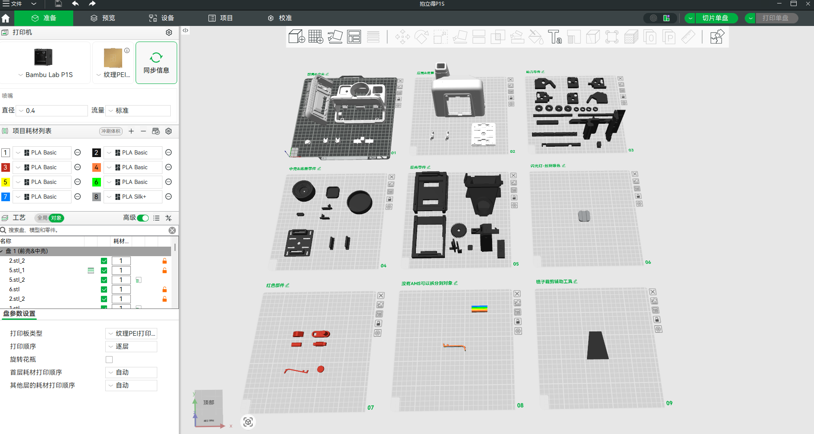
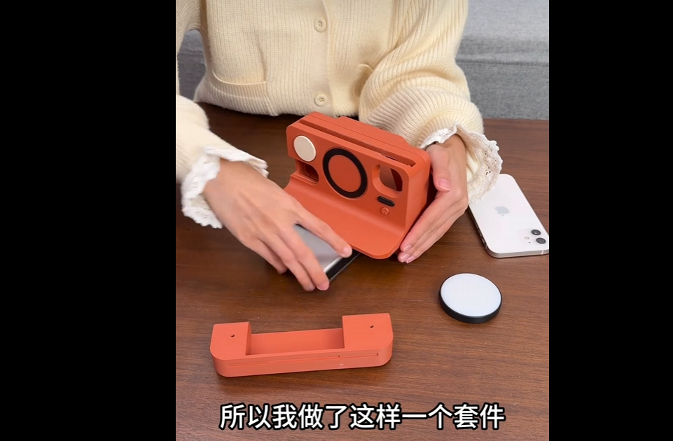

##### 1、今天研究了一下拍立得模型结构

可以参考以下几个模型

[【林嘉驹】能拍照的拍立得模型 - 免费 3D 打印模型 - MakerWorld](https://makerworld.com.cn/zh/models/1478735-lin-jia-ju-neng-pai-zhao-de-pai-li-de-mo-xing?from=search#profileId-1612068)

https://www.bilibili.com/video/BV1KFUnB9Exx

##### 2、深度使用了一下app，发现了一些问题

1）没法设置1：1，只能后期加上自动裁剪

2）没法边缘返回菜单界面

3）需要设置完全适合米家照片相纸的尺寸

4）需要增加边框预设，如留白和边框自定义等功能

5）可以预选一系列边框，按照顺序或者随机出现

6）没有办法拍摄打印后，返回app继续拍照